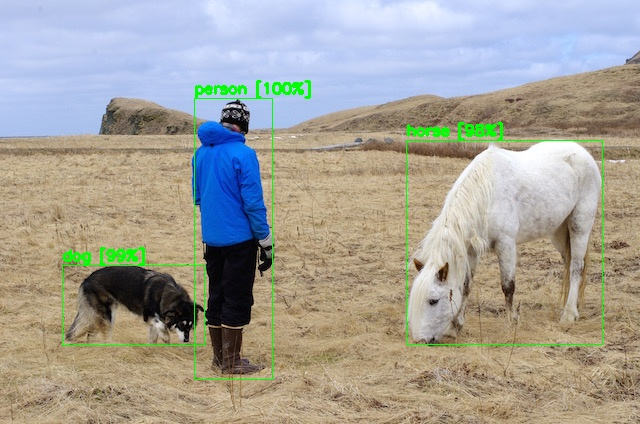

# yolo V4 result 결과 저장 파일

## 발단

https://github.com/pjreddie/darknet/issues/723  

위 이슈와 같이 yolo의 경우 여러 이미지에 대한 prediction.jpg 저장하는 방법에 대해 명확한 방법이 없는 상황  
이를 위해 ext_output 결과 txt 를 이용하여 다음을 생성하는 코드  
* 결과 이미지가 표시된 jpg 생성
* 각각의 object의 정확도가 표시된 csv 파일
* 전체 detect 된 object 개수와 탐지 시간이 담긴 json 파일 


## how to use
먼저 Yolov4_Tutorials.ipynb 파일을 colab에서 진행하여 person.jpg 와 result.txt 를 저장하여 data 에 세팅  
그 후 result.ipynb 진행 혹은 아래 bash 진행
```bash
python result.py -i data/result.txt -o result/
```

## 결과
원본  
  
결과  
